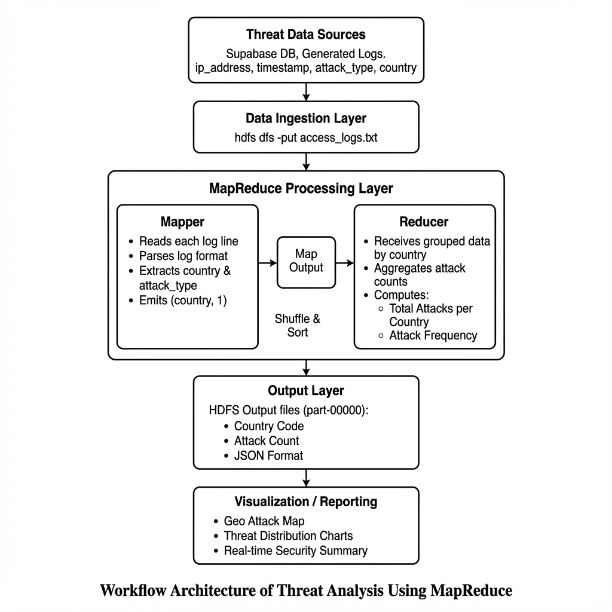

# Threat Analysis & Visualization Platform

A comprehensive Big Data Analytics project that processes security logs using **Hadoop MapReduce** and **Hive**, and visualizes threat intelligence on a modern React dashboard.

## 🏗️ Architecture



This project simulates a full data pipeline:
1.  **Ingestion**: Logs are fetched from Supabase (or generated locally) and uploaded to HDFS.
2.  **Processing**: A Hadoop Streaming MapReduce job (Python) processes the logs to aggregate threat data by country and attack type.
3.  **Analysis**: Hive external tables queries are used for deeper SQL-based analysis.
4.  **Visualization**: The results are consumed by a frontend dashboard built with React, Vite, and Recharts.

## 🚀 Prerequisites

To run this project efficiently, ensure you have the following installed:

-   **Node.js** (v18+)
-   **Java 17** (Required for Hadoop)
-   **Hadoop** (v3.x) - Configured in Standalone or Pseudo-distributed mode.
-   **Python 3**

## 🛠️ Installation

1.  **Clone the repository**:
    ```bash
    git clone https://github.com/nishith-s-acharya/hadoop_project.git
    cd hadoop_project
    ```

2.  **Install dependencies**:
    ```bash
    npm install
    ```

## 💻 Usage

### 1. Run the Analysis Pipeline (Backend)
This command handles everything: fetching logs, uploading to HDFS, running MapReduce, and generating JSON output.
```bash
npm run hadoop
```
*Note: Ensure your Hadoop environment is correctly set up.*

### 2. Start the Dashboard (Frontend)
Launch the web interface to view the visualization of the analysis.
```bash
npm run dev
```
Open **http://localhost:8080** in your browser.

## 📂 Project Structure

-   `/hadoop` - Contains the backend logic (Python Mappers/Reducers, Hive scripts).
-   `/src` - React frontend code.
-   `/hdfs_data` - Local storage for HDFS simulation.
